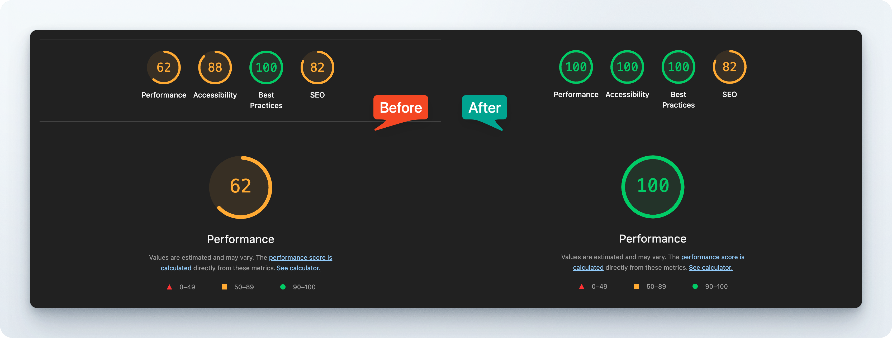
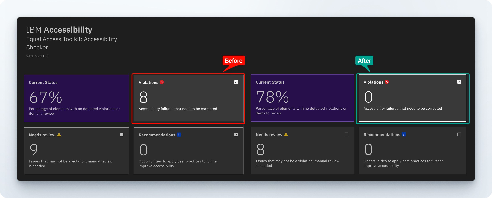

# Notely App

A simple React + TypeScript application for collecting and reviewing short notes.

## How to Run

```bash
npm install
npm run dev
# 🏎️ or perhaps `bun install / dev` if you feel like it
```

Open `http://localhost:5173` in your browser.

## Performance

Lighthouse scores before and after optimizations:


Performance and Accessibility both improved to 100; Best Practices and SEO were already strong and stayed the same.

## Accessibility Report

IBM accessibility scan results before and after improvements, showing identified vulnerabilities and their resolution:




## Design Notes

Notely is a single `App` component with child components (`NoteInput`, `NoteList`, `NoteCard`) for simplicity. State managed via React hooks with automatic localStorage persistence.

**Data Model:** Notes use timestamp-based IDs, contain 5-300 character text, and have `pending` or `approved` status.

**Key Decisions:**
- Timestamp IDs for simplicity and uniqueness
- Separate CSS file for maintainability
- Real-time validation with character counter
- Filtering by status (all/pending/approved)
- Markdown support for rich text formatting in notes

**Tech Stack:** React 18, TypeScript, Vite, localStorage, marked (markdown parser)

### Things to implement for the future:

- QA engineering measure: test Notely against [😈 The Big List of Naughty Strings](https://github.com/minimaxir/big-list-of-naughty-strings)
- Filter by status (pending/approved/all)
- Search functionality
- Note categories/tags

## Known Vulnerabilities

Below is the list of known vulnerabilities that need to be fixed in the next steps.

- XSS possible via markdown: The `marked` library output is NOT sanitized before rendering with `dangerouslySetInnerHTML`. Upon inital look, adding [DOMPurify](https://github.com/cure53/DOMPurify) to sanitize HTML output would be a practical resolution.

## 🔗 Live Demo

**[Try it here](https://notely-sand.vercel.app/)**